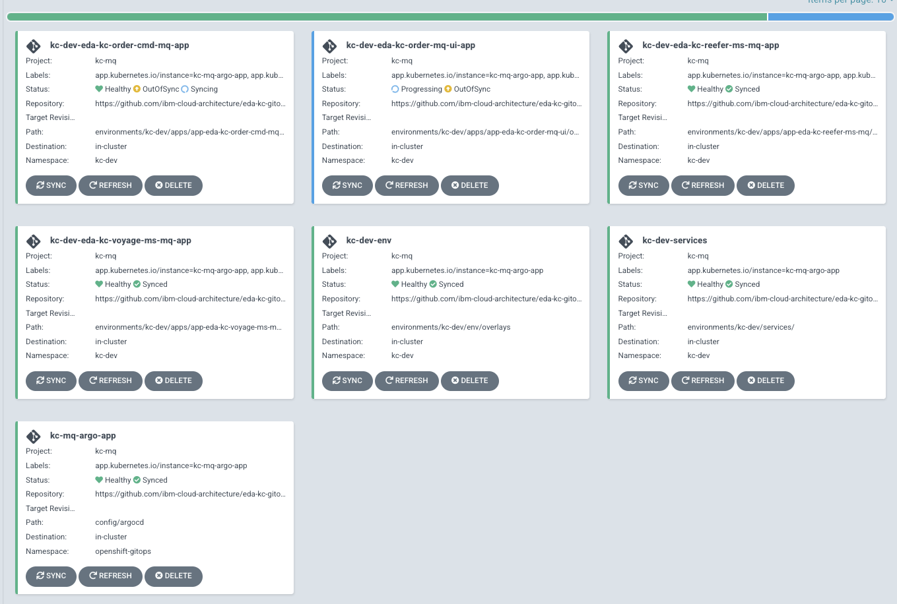

# EDA KContainer shipment solution GitOps repository

This is the 2022 version of the KC solution. The update is for adopting MQ to support SAGA orchestration and
Kafka for eventing.

This repository uses a GitOps approach to manage deployment to OpenShift Cluster. Also we make 

## Scenario presentation

## Bootstrap GitOps on OpenShift


## Run the solution locally

### MQ Saga demonstration

* Start local MQ and services

```sh
cd local-demo/mq-based
docker compose up
```
* The User interface to demonstrate the MQ saga is on URL [http://localhost:8089](http://localhost:8089)
* The Swagger for Order is [http://localhost:8080](http://localhost:8080/q/swagger-ui)
* The Swagger for Voyage is [http://localhost:8081](http://localhost:8081/q/swagger-ui)

* Stop the demo

```sh
docker compose down
```

## GitOps 

### How this repository was created

We used KAM CLI to create the project with the following parameters:

Get Github access token, to be used in the KAM bootstrap command, in future steps.


```sh
kam bootstrap \
--service-repo-url https://github.com/ibm-cloud-architecture/eda-kc-order-cmd-mq \
--gitops-repo-url  https://github.com/ibm-cloud-architecture/eda-kc-gitops \
--image-repo quay.io/ibmcase/ \
--output eda-kc-gitops \
--git-host-access-token <a-github-token> \
--prefix kc-mq --push-to-git=true
```

### What was added

* Added a bootstrap folder to define gitops and operator declaration and to create an ArgoCD project
* Defined a script to install IBM Catalogs and Cloud Pak for Integration components 
* Added scripts to deploy the gitops, pipelines operators: `scripts/installOperators.sh`


### Bootstrap

* Login to the OpenShift Console, and get login token to be able to use `oc cli`
* If not done already, use the script to install GitOps and Pipeline operators: 

  ```sh
    cd bootstrap/scripts/
    ./installGitOpsOperators.sh
  ```
    
  Once the operators are running the command: `oc get pods -n openshift-gitops` should return
a list of pods like:

  ```sh
    NAME                                                          READY   STATUS    RESTARTS   AGE
    openshift-gitops-application-controller-0                     1/1     Running   0          4h5m
    openshift-gitops-applicationset-controller-6948bcf87c-jdv2x   1/1     Running   0          4h5m
    openshift-gitops-dex-server-64cbd8d7bd-76czz                  1/1     Running   0          4h5m
    openshift-gitops-redis-7867d74fb4-dssr2                       1/1     Running   0          4h5m
    openshift-gitops-repo-server-6dc777c845-gdjhr                 1/1     Running   0          4h5m
    openshift-gitops-server-7957cc47d9-cmxvw                      1/1     Running   0          4h5m
  ```

* If not done already, install IBM product catalog

  ```sh
  ./bootstrap/scripts/installIBMCatalog.sh
  ```

* Obtain your [IBM license entitlement key](https://github.com/IBM/cloudpak-gitops/blob/main/docs/install.md#obtain-an-entitlement-key)
* Update the [OCP global pull secret of the `openshift-operators` project](https://github.com/IBM/cloudpak-gitops/blob/main/docs/install.md#update-the-ocp-global-pull-secret)
with the entitlement key

    ```sh
    KEY=<yourentitlementkey>
    oc create secret docker-registry ibm-entitlement-key \
    --docker-username=cp \
    --docker-server=cp.icr.io \
    --namespace=openshift-operators \
    --docker-password=$KEY 
    ```
* Deploy IBM product Operators to monitor All Namespaces 


  ```sh
  ./bootstrap/scripts/installIBMOperators.sh
  ```
 
* Create ArgoCD project named `kc-mq`

   ```sh
   oc apply -k bootstrap/argocd-project
   ```

* To get the `admin` user's password use the command

    ```sh
    oc extract secret/openshift-gitops-cluster -n openshift-gitops --to=-
    ```

* Get the ArgoCD User Interface URL and open a web browser

   ```sh
   chrome https://$(oc get route openshift-gitops-server -o jsonpath='{.status.ingress[].host}'  -n openshift-gitops)
   ```


* To start the CD management with ArgoCD, just executing the following should work.

```sh
oc apply -k config/argocd
```

The expected set of ArgoCD apps looks like:



  * Argo-app is an app of apps
  * dev-env is for the rt-inventory-dev namespace
  * dev-services is for event streams and mq deployment in dev-env namespace