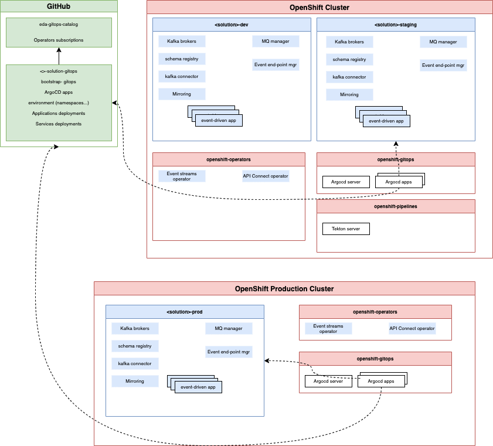
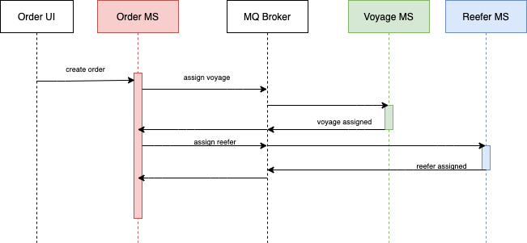
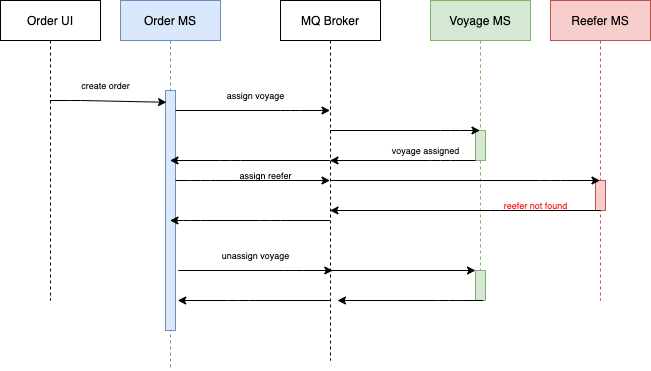

# EDA KContainer shipment solution GitOps repository

This is the 2022 version of the [KC solution](https://ibm-cloud-architecture.github.io/refarch-kc/) GitOps. 

Updated 02/25/2022. 

The current update is for the SAGA pattern orchestration with MQ and Kafka for eventing. 

As the implementation of the GitOps practice, this repository includes how to deploy IBM Event Streams and IBM MQ
as well as the microservices that are part of the solution. 

This project was created with [KAM CLI](https://github.com/redhat-developer/kam) and use the [eda-gitop-catalog](https://github.com/ibm-cloud-architecture/eda-gitops-catalog) for IBM cloud pak for integration operator deployment.

## Gitops approach

The main approach for the gitops is described in [this note](https://ibm-cloud-architecture.github.io/refarch-eda/use-cases/gitops/#high-level-architecture-view). The figure below is to illustrate that this current repository is 



## Saga with MQ scenario presentation

The [Saga pattern](https://ibm-cloud-architecture.github.io/refarch-eda/patterns/saga/) helps to support a long running 
transaction that can be broken up to a collection of sub transactions that can be interleaved any way with other transactions.

The SAGA orchestration is done by the order service that sends commands to drive each SAGA participant on what to do and when. 
To support strong consistency and exactly once delivery we are using Queues.

The Saga will be started by adding a new order, or updating major caracteristics of an existing order.

The demonstration illustrates the happy path, where each participants respond positively, so voyage and container are
assigned to the order,



and one uncomplete path, where the order will not be satisfied because of lack of refrigerator containers.



So the compensation logic will roll back the Voyage assignment.


## Run the solution locally

You have two options to demonstrate this solution, one running on your local laptop (using docker compose) and one running on OpenShift.

### MQ Saga demonstration

* Start local MQ and services

```sh
cd local-demo/mq-based
docker compose up -d
```
* The User interface to demonstrate the MQ saga is on URL [http://localhost:8089](http://localhost:8089)
* The Swagger for Order is [http://localhost:8080](http://localhost:8080/q/swagger-ui)
* The Swagger for Voyage is [http://localhost:8081](http://localhost:8081/q/swagger-ui)

The demonstration scenario script in [this separated note](https://ibm-cloud-architecture.github.io/refarch-eda/scenarios/saga-orchestration/#full-demo-narration).

* Stop the demo

```sh
docker compose down
```

## GitOps 

### How this repository was created

We used KAM CLI to create the project with the following parameters:

Get Github access token, to be used in the KAM bootstrap command, in future steps.


```sh
kam bootstrap \
--service-repo-url https://github.com/ibm-cloud-architecture/eda-kc-order-cmd-mq \
--gitops-repo-url  https://github.com/ibm-cloud-architecture/eda-kc-gitops \
--image-repo quay.io/ibmcase/ \
--output eda-kc-gitops \
--git-host-access-token <a-github-token> \
--prefix kc-mq --push-to-git=true
```

### What was added

* Added a bootstrap folder to define gitops and operator declaration and to create an ArgoCD project
* Defined a script to install IBM Catalogs and Cloud Pak for Integration components 
* Added scripts to deploy operators: `scripts/installOperators.sh`
* Specific script to install IBM's product operators.


### Bootstrap GitOps

* You may need to install the following tools:

```
brew install kubeseal
brew install jq
```

* Login to the OpenShift Console, and get login token to be able to use `oc cli`
* If not already done, use the script to install GitOps and Pipeline operators: 

  ```sh
    ./bootstrap/scripts/installGitOpsOperators.sh
  ```
    
  Once the operators are running the command: `oc get pods -n openshift-gitops` should return
a list of pods like the following:

  ```sh
    NAME                                                          READY   STATUS    RESTARTS   AGE
    openshift-gitops-application-controller-0                     1/1     Running   0          4h5m
    openshift-gitops-applicationset-controller-6948bcf87c-jdv2x   1/1     Running   0          4h5m
    openshift-gitops-dex-server-64cbd8d7bd-76czz                  1/1     Running   0          4h5m
    openshift-gitops-redis-7867d74fb4-dssr2                       1/1     Running   0          4h5m
    openshift-gitops-repo-server-6dc777c845-gdjhr                 1/1     Running   0          4h5m
    openshift-gitops-server-7957cc47d9-cmxvw                      1/1     Running   0          4h5m
  ```

* If not done already, install IBM product catalog subscriptions, so the OpenShift Cluster can get visibility of IBM product within the OpenShift Operator Hub:

  ```sh
  ./bootstrap/scripts/installIBMCatalog.sh
  ```

* Obtain your [IBM license entitlement key](https://github.com/IBM/cloudpak-gitops/blob/main/docs/install.md#obtain-an-entitlement-key)
* Update the [OCP global pull secret of the `openshift-operators` project](https://github.com/IBM/cloudpak-gitops/blob/main/docs/install.md#update-the-ocp-global-pull-secret)
with the entitlement key

    ```sh
    export KEY=<yourentitlementkey>
    oc create secret docker-registry ibm-entitlement-key \
    --docker-username=cp \
    --docker-server=cp.icr.io \
    --namespace=openshift-operators \
    --docker-password=$KEY 
    ```
    
* Deploy IBM product Operators (Event Streams, MQ) to monitor All Namespaces 

  ```sh
  ./bootstrap/scripts/installIBMOperators.sh
  ```
 
* Create ArgoCD project named `kc-mq`

   ```sh
   oc apply -k bootstrap/argocd-project
   ```

* To get the `admin` user's password use the following command

    ```sh
    oc extract secret/openshift-gitops-cluster -n openshift-gitops --to=-
    ```

* Get the ArgoCD User Interface URL and open a web browser

   ```sh
   chrome https://$(oc get route openshift-gitops-server -o jsonpath='{.status.ingress[].host}'  -n openshift-gitops)
   ```


* To start the Continuous Deployment management with ArgoCD, just executing the following command:

   ```sh
   oc apply -k config/argocd
   ```

The expected set of ArgoCD apps looks like the following:


  * Argo-app is an app of apps
  * dev-env is for the rt-inventory-dev namespace
  * dev-services is for event streams and mq deployment in dev-env namespace
  * kc-dev-eda-kc-order-cmd-mq-app: the order manager microservice deployment, using MQ for the saga
  * kc-dev-eda-kc-order-mq-ui-app: the user interface app for demonstration
  * kc-dev-eda-kc-reefer-ms-mq-app: the Refrigerator container, Reefer, manager microservice participant into the SAGA
  * kc-dev-eda-kc-voyage-ms-mq-app: The Voyage (Vessel trips) manager microservice also  participant into the SAGA
